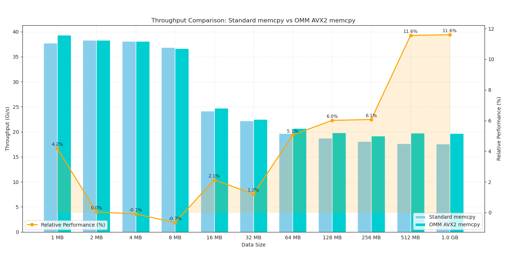

# Optimized Memory Management (OMM) Library

**Note: This library is currently in early development and is not yet ready for production use.**

OMM aims to be a high-performance, header-only C++ library designed for efficient memory operations. It currently focuses on optimized memory allocation, memory setting, and memory copy methods.



## Features

- Optimized `memcpy` implementations using AVX2 and AVX-512 instructions
- Header-only design for easy integration
- Benchmarking suite for performance testing
- Comprehensive test suite (coming soon)

## Requirements

- C++20 compatible compiler
- CMake 3.15 or higher
- AVX2 support (for optimal performance)

## Installation

OMM is a header-only library, which means you can simply include it in your project. However, for the best experience and to run tests and benchmarks, we recommend using CMake:

```bash
git clone https://github.com/nmehran/omm.git
cd omm
mkdir build && cd build
cmake -DOMM_BUILD_TESTS=ON -DOMM_BUILD_BENCHMARKS=ON ..
make
```

Note: By default, tests and benchmarks are not built. Use the CMake options `-DOMM_BUILD_TESTS=ON` and `-DOMM_BUILD_BENCHMARKS=ON` to enable them as shown above.

## Usage

Here's a basic example of using OMM's optimized `memcpy`:

```cpp
#include <omm/memcpy/memcpy.hpp>

int main() {
    const size_t size = 1024 * 1024; // 1 MB
    std::unique_ptr<char[]> src = std::make_unique<char[]>(size);
    std::unique_ptr<char[]> dest = std::make_unique<char[]>(size);

    // Use OMM's optimized memcpy
    omm::memcpy(dest.get(), src.get(), size);

    return 0;
}
```

## Benchmarks

OMM includes a benchmarking suite to measure the performance of its memory operations. To build and run the benchmarks:

```bash
cd build
cmake -DOMM_BUILD_BENCHMARKS=ON ..
make
./benchmarks/memcpy_benchmarks
```

## Testing

To build and run the test suite:

```bash
cd build
cmake -DOMM_BUILD_TESTS=ON ..
make
ctest
```

## Contributing

Before you start coding, we recommend discussing your ideas first as part of an issue.

We particularly value performance optimizations, bug fixes, and well-documented improvements to maintainability and flexibility.

Pull requests that don't follow these guidelines may need revision before they can be accepted.

## License

This project is licensed under the Apache License 2.0 - see the [LICENSE](LICENSE) file for details.

---

OMM is an experimental library motivated by the significant gap between current performance and the theoretical maximum of memory throughput.

## TODO

- AVX-512 testing for `memcpy`
- Further memory copy optimizations
- Implement memory allocation methods
- Implement `memset` operations
- Broad architecture and platform compatibility
- Comprehensive test suite