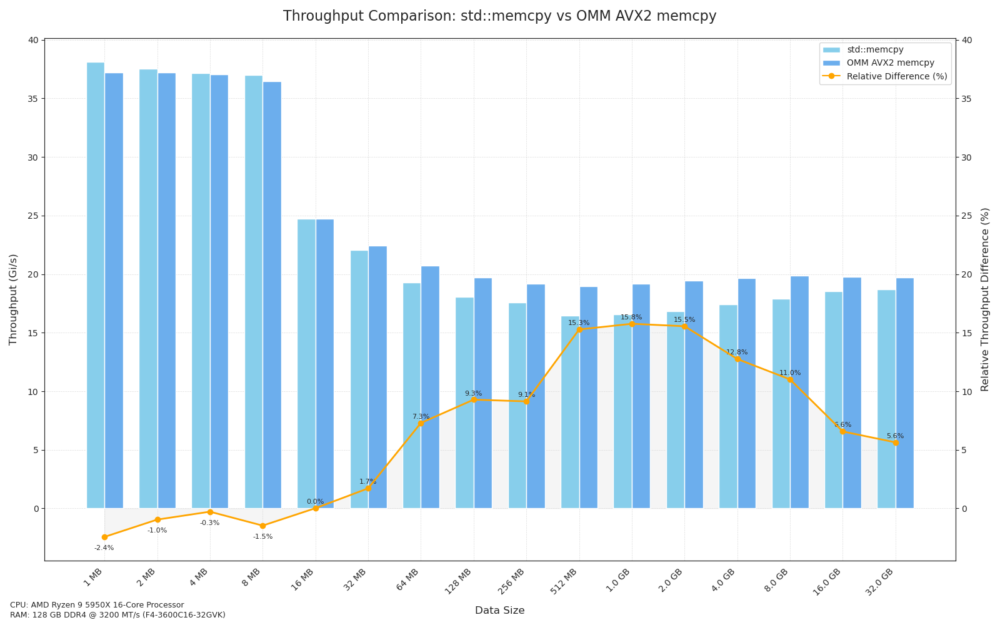

# Optimized Memory Management (OMM) Library

**Note: This library is currently in early development and is not yet ready for production use.**

OMM aims to be a high-performance, header-only C++ library designed for efficient memory operations. It currently focuses on optimized memory allocation, memory setting, and memory copy methods.



## Features

- Optimized `memcpy` implementations using AVX2 and AVX-512 instructions
- Header-only design for easy integration
- Benchmarking suite for performance testing
- Comprehensive test suite (coming soon)

## Requirements

- C++20 compatible compiler
- CMake 3.15 or higher
- AVX2 support (for optimal performance)

## Installation

OMM is a header-only library, which means you can simply include it in your project. However, for the best experience and to run tests and benchmarks, we recommend using CMake:

```bash
git clone https://github.com/nmehran/omm.git
cd omm
mkdir build && cd build
cmake -DOMM_BUILD_TESTS=ON -DOMM_BUILD_BENCHMARKS=ON ..
make
```

Note: By default, tests and benchmarks are not built. Use the CMake options `-DOMM_BUILD_TESTS=ON` and `-DOMM_BUILD_BENCHMARKS=ON` to enable them as shown above.

## Usage

Here are two basic examples of using OMM's optimized `memcpy`:

#### Example 1: Using std::vector

```cpp
#include <omm/memcpy.h>
#include <vector>

int main() {
    const size_t size = 1024 * 1024 * 1024; // 1GB
    std::vector<char> src(size, 'A');  // Initialize src with some data
    std::vector<char> dest(size);

    omm::memcpy(dest.data(), src.data(), size);  // Use OMM's optimized memcpy

    return 0;
}
```

#### Example 2: Using raw pointers

```cpp
#include <omm/memcpy.h>
#include <cstdlib>

int main() {
    const size_t size = 1024 * 1024 * 1024; // 1GB
    char* src = static_cast<char*>(std::malloc(size));
    char* dest = static_cast<char*>(std::malloc(size));

    if (src && dest) {
        std::memset(src, 'A', size);   // Initialize src with some data
        omm::memcpy(dest, src, size);  // Use OMM's optimized memcpy

        // Free the allocated memory
        std::free(src);
        std::free(dest);
    }

    return 0;
}
```


## Benchmarks

OMM includes a benchmarking suite to measure the performance of its memory operations. For consistent results, it's recommended to set the CPU governor to performance mode before running benchmarks.

1. Set CPU governor to performance mode:

```bash
sudo ./extras/manage_cpu_scaling.sh set performance
```

2. Build and run the benchmarks:

```bash
cd build
cmake -DOMM_BUILD_BENCHMARKS=ON ..
make
./benchmarks/memcpy_benchmarks
```

3. After benchmarking, restore previous CPU settings:

```bash
sudo ./extras/manage_cpu_scaling.sh restore
```

Note: The `manage_cpu_scaling.sh` script provides various options for CPU frequency scaling management. Run `./extras/manage_cpu_scaling.sh` without arguments to see usage instructions.

## Testing

To build and run the test suite:

```bash
cd build
cmake -DOMM_BUILD_TESTS=ON ..
make
ctest
```

## Contributing

Performance optimizations, bug fixes, and improvements to maintainability and flexibility are particularly valued.

Before you start coding, please consider first discussing your ideas as part of an issue.

## License

This project is licensed under the Apache License 2.0 - see the [LICENSE](LICENSE) file for details.

---

OMM is an experimental library striving to maximize memory throughput.

## TODO

- AVX-512 testing for `memcpy`
- Further memory copy optimizations
- Implement memory allocation methods
- Implement `memset` operations
- Broad architecture and platform compatibility
- Comprehensive test suite